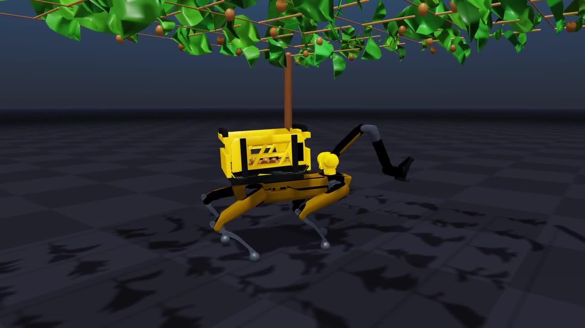

# Thekenyos · Kiwi harvesting robotics



A research simulation for a **Spot quadruped with one arm**, harvesting kiwis
under a **1.6 m pergola canopy** and carrying them in a rear basket.

Built on [OrchardBench](https://github.com/humphreymunn/orchardbench),
[Newton](https://github.com/newton-physics/newton), MuJoCo-Warp and native MuJoCo.
The first milestone is one robot. All fruit starts harvestable. Multi-robot
coordination, maturity perception and automatic unloading come later.

The current programme is **simulation-only**. Numerical tests and consistency
with published material data are separate from real-fruit calibration, which
is pending. The 0–6 kg fruit range remains a simulation stress-test range.
Spot's [14 kg combined payload limit](https://dev.bostondynamics.com/docs/payload/payload_configuration_requirements.html)
includes its 8 kg arm, basket and other payloads. With an assumed 1.2 kg basket,
at most 4.8 kg remains before additional payload hardware. This is a mass budget,
not approval of the basket geometry or loaded workspace.

## What works, and what does not

| Component | Current implementation |
|---|---|
| Pergola | Seeded configurable commercial plantation, 4.5–5 m structural grid, continuous rows, tied canes, compliant tips and hanging fruit |
| Terrain | Optional procedural noise heightfield by default; explicit `--terrain-kind orchard` retains grassed aisles, furrows, slope and terrain-aligned posts/Spot |
| Spot | External RELIC robot assets and pretrained ONNX gait; scripted velocity route |
| Basket | Rear chassis-mounted yellow panels, vents, black frame, handles and mounting feet; open-top collision liner |
| Basket payload | Separate free, collidable fruit; 0–6 kg; gravity, rotation, packing and spills |
| Canopy fruit | Coupled Hayward size/mass/density envelope; free ellipsoids with stem-site spring forces |
| Stems | Axial/bending stiffness derived from measured stalk dimensions; irreversible load-triggered detachment |
| Damage | Persistent contact/strain **proxy**, with negative increments available as reward terms |
| Deformable fruit | Separate native MuJoCo tetrahedral compression/release bench with Xuxiang flesh stiffness |
| Task evaluator | Outcome-based single-fruit oracle with optional guidance; [task definition](docs/harvest-task.md) |
| RL environment | Gymnasium fixed-base Spot interface, substep oracle and reset/failure checks; rigid-fruit integration surrogate |
| RL training | Earlier diagnostic pilot used faulty CPU hand collision filtering; checkpoint retained for regression only. Training paused for physics validation |

The upstream harvesting demo uses a hand-to-fruit spring as a grip assist,
including stronger recentring after detachment (`treesim/fruit.py`). That is
useful demo behavior, but does not validate whether Spot's jaws can retain a
kiwi using contact and friction alone. `KiwiField.hold()` explicitly rejects
that assist. We reuse the orchard framework, not its grasp success as physical
validation. Native deformable-gripper tests are our additions.

**The GPU orchard fruit is still rigid collision geometry.** The native flex
bench deforms against Spot jaw meshes, but is not yet integrated into the GPU
orchard or full-arm control.
Neither model is a validated predictor of bruising. Layered skin/core,
viscoelastic/plastic constitutive laws, calibrated wet friction and
calibrated angle/torque-dependent abscission remain open work. Research ranges are not
interchangeable across cultivars and test conditions.

## Install

The tested GPU platform is Linux with an NVIDIA RTX 5090. Python 3.12,
Newton 1.3.0, Warp 1.14.0 and MuJoCo/MuJoCo-Warp 3.8.1 are pinned. First runs
compile CUDA kernels and can take several minutes. The full GPU workflow is
not verified on macOS.

```bash
git clone https://github.com/EduardGilM/Thekenyos.git
cd Thekenyos
conda env create -f environment.yml
conda activate kiwi-pergola
python -m unittest discover -s tests -v
```

`ffmpeg` is included for videos. Use a working OpenGL display for Newton's GL
viewer. Native MuJoCo recordings can use `MUJOCO_GL=egl` on Linux. `--no-render`
on the Spot script avoids a display dependency. Do not upgrade Warp alone:
the earlier Warp 1.17 combination failed on this workstation.

### External Spot assets

RELIC assets and policy weights are **not redistributed in this repository**.
Review its [license](https://github.com/rai-opensource/relic) before use: its
noncommercial research terms differ from this project's Apache-2.0 code.

```bash
git clone https://github.com/rai-opensource/relic.git ../relic
git -C ../relic checkout 27f8033c5064d32f049a17accb71cd1091422878
```

The adapter loads `source/relic/relic/assets/spot/spot_with_arm.urdf`,
`constants.py` and `pretrained/policy.onnx`. It does not require Isaac Sim.

## Run the demos

### Procedural pergola

```bash
python scripts/grow_tree.py --preset pergola --foliage --seed 42 \
  --collisions --substeps 40 --viewer gl
```

Select the retained grassed orchard-floor generator explicitly:

```bash
python scripts/grow_tree.py --preset pergola --foliage --terrain --terrain-kind orchard --seed 42 \
  --collisions --substeps 40 --viewer gl
```

The scene is built programmatically in Python; it is not a hand-authored pergola
XML. The default pergola is 40 posts along 45 rows at 5 m centres, about
4.3 hectares. Use `--pergola-rows`, `--pergola-columns`, and
`--pergola-spacing` (4.5–5.0 m) to scale the field; render-only foliage is
enabled by default for this preset, while `--foliage-density 0` disables it.
Use `--fruit-count` to cap the independent kiwi bodies (the default is 600 for
the plantation). Change geometry in `treesim/pergola.py`. Add `--terrain` for
the procedural noise floor, or `--terrain --terrain-kind orchard` for the
retained orchard floor (grassed aisles, planting strips, slope and noise). The native compression bench writes its own generated
MuJoCo XML to its output directory.

On a 4 GB GTX 1650, record the full 45×40 block with MuJoCo EGL (no
render-only foliage). This is a scripted flyover, not Spot gait. The flag
refuses a CPU fallback:

```bash
python scripts/record_orchard_mujoco.py --seed 42 --require-gpu \
  --video output/orchard-mujoco.mp4
```

Newton GL with foliage is a separate viewer. A 4 GB card should crop the
grid; a larger NVIDIA GPU can keep the commercial default:

```bash
python scripts/record_scene.py --video output/plantation-gpu.mp4 --orbit \
  --preset pergola --terrain --terrain-kind orchard --foliage --seed 42 --frames 600 \
  --pergola-rows 5 --pergola-columns 4
```

#### Continuous leaf roof (render-only)

For a continuous **visual leaf roof**, `--canopy-spacing .08` adds overlapping
leaf blades across the entire post footprint, rather than only along the sparse
fruiting canes. The spacing is in metres; zero (the default) keeps the original
foliage. This is a seeded artistic canopy approximation, not a measured crop or
additional physical branches. The extra leaves are massless, non-colliding,
attached to supported cane bodies, and follow the canopy slope. The option is
pergola-only and cannot be combined with `--foliage-physics` or disabled foliage.
Use cropped plots: the additional layer is capped at 100,000 leaves, and increases
rendering/build cost even though it adds no physical bodies or degrees of freedom.

A single local frame, with the same camera and terrain as the visual experiments:

```bash
.venv/bin/python -B scripts/grow_tree.py --preset pergola --foliage --leaves 32 \
  --canopy-spacing .08 --seed 42 --pergola-rows 3 --pergola-columns 3 \
  --fruit-count 40 --terrain --terrain-seed 202 --terrain-amplitude .05 \
  --terrain-wavelength 1.8 --terrain-extent 6 --device cpu --substeps 40 \
  --viewer gl --headless --frames 1 --snapshot output/kiwi-canopy-roof.png
```

This recipe produces a 1920x1080 PNG after one simulation frame. Its 3x3 posts
at 5 m centres enclose 100 m²: 15,625 infill leaves plus 1,152 twig leaves, or
16,777 leaves total. The 40 kiwis remain separate physical fruit (0.4 fruit/m²);
adding the visual roof does not add fruit or fruit attachment sites.

How the roof is generated:

- `scripts/grow_tree.py` maps `--canopy-spacing` to
  `cfg.foliage.canopy_spacing_m`. **This is the control that closes the gaps**;
  `--leaves 32` alone only thickens the existing cane lines. Zero disables infill;
  nonzero spacing must be finite and at least 0.03 m. Larger spacing reduces
  coverage and cost; leaf count scales approximately with `1 / spacing²`.
- `treesim/foliage.py::place_canopy_leaves` fills the horizontal skeleton bounds
  with `ceil(width / spacing) * ceil(length / spacing)` cells, one leaf per cell.
  A separate RNG (`scene seed + 1777`) jitters leaf centres within their cells,
  so the arrangement is reproducible without perturbing fruit sampling.
- Leaf centres sit 4–18 cm above a plane fitted to the supported canes, following
  the canopy slope. Random heading, tilt and roll break up the flat-grid look;
  overlapping blades, rather than a solid opaque sheet, form the roof.
- `treesim/builder.py` attaches each placement to the supported cane with the
  nearest midpoint and reuses three leaf-size mesh classes. The CLI's nominal
  kiwi blade is 22x17 cm; the size classes scale it by 0.72, 1.0 and 1.35.
  No extra physical branches, joints, leaf mass or leaf contacts are introduced.

Geometry, CLI and unchanged-mass/contact/one-step regressions are included in
`python -B -m unittest tests.test_pergola -v`. This preview is neither PBR
postprocessing nor a learned rollout; it changes only the rendered foliage.

The trellis has fixed transverse support wires. Main cane sections are tied
rigidly to this frame; only the final 0.35 m tips bend. This is an ideal-support
assumption, not calibrated wire tension or tie compliance. It replaces the
unsupported 2.3 m cantilevers that sagged into the robot's workspace. Fruit
stems are drawn between the actual force attachment sites and disappear on
rupture; fruit remains an independent physical body.

### Uneven kiwi terrain for future RL episodes

`--terrain` uses a **physical collision heightfield**, not just a visual mesh.
For the kiwi pergola, three octaves of **smooth value noise** (quintic
interpolation, decreasing octave amplitudes) generate continuous rolling ground.
There are no post-centred masks, flat pads or artificial mounds. Posts remain
embedded below the surface, rather than reshaping the ground around them; the
canopy stays at its world-space height. Kiwi terrain gets a **fresh random seed
each launch**, even with a fixed canopy `--seed`. Flat ground remains the default,
and the apple terrain retains its flat trunk area and original seed behaviour.
The noise generator takes priority for `--terrain`; select `--terrain-kind
orchard` (Python: `cfg.physics.terrain_kind = "orchard"`) only for the retained
slope/furrow generator. Noise amplitude/wavelength/extent controls do not tune
that alternative; it uses the `orchard_*` parameters. Both modes support an
explicit `terrain_seed`; orchard mode otherwise inherits the scene seed.

The CPU examples crop the newer plantation geometry to **3 × 3 posts**, retaining
supported canes and compliant tips. This fits a 12 m terrain patch and supports
40 fruit without instantiating the default commercial field.

```bash
python scripts/grow_tree.py --preset pergola --foliage --seed 42 \
  --pergola-rows 3 --pergola-columns 3 --fruit-count 40 \
  --terrain --terrain-amplitude .24 \
  --terrain-wavelength 1.8 --terrain-extent 6 \
  --device cpu --substeps 40 --viewer gl --headless --frames 360 \
  --camera-orbit 20 --snapshot output/kiwi-uneven-terrain.png \
  --video output/kiwi-uneven-terrain.mp4 --metrics output/kiwi-uneven-terrain.json
```

Use `.venv/bin/python` instead of `python` with the local virtual environment.
Remove `--headless` for an interactive window; remove recording options and use
`--viewer null` for display-free physics. CPU rendering still needs working
OpenGL. The MP4 records every second physics frame at 30 fps, matching the
60 Hz simulation clock. `--snapshot` saves the last frame. The orbit is a
scripted camera motion, not robot motion or learned behaviour.

Terrain controls (engineering assumptions, **not measured orchard soil**):

- `--terrain-amplitude`: nonnegative height range in metres above a 4 mm offset;
  default 0.05 m. The 0.24 m preview deliberately makes relief easier to see;
  start with 0.03–0.05 m for robot experiments. Traversability is not validated.
- `--terrain-wavelength`: positive dominant bump spacing in metres; default 1.8.
  Three noise scales share a finite-resolution grid, so very small wavelengths
  cannot create arbitrarily fine geometry.
- `--terrain-extent`: ground half-extent in metres; 6 gives a 12 × 12 m patch.
  If omitted (`terrain_extent=None` in Python), it fits the plantation with a
  0.5 m post margin and a minimum half-extent of 14 m. An explicit value must
  cover the posts plus that margin. Outside the patch, ground is flat; constrain
  training episodes to the patch (the edge may have a step).
- `--terrain-seed`: specify a nonnegative integer (for example,
  `--terrain-seed 7`) to reproduce exactly the same ground. **Omit it for new
  random kiwi ground on every launch**, independently of the canopy and fruit.
  The chosen seed is printed at startup and saved in metrics. Rebuild at episode
  reset with a new seed or amplitude for curriculum/domain randomization.
  Batched worlds share one terrain; independent per-world terrain generation
  and terrain-aware RL integration are not implemented here. The existing
  fixed-base harvesting interface is documented separately below.

Programmatic use: set `cfg.physics.terrain = True`, `terrain_seed`,
`terrain_amplitude`, `terrain_wavelength`, and `terrain_extent` before calling
`builder.generate_and_build(cfg)`. For deterministic programmatic builds,
`terrain_seed=None` still inherits `cfg.seed`; sample a new `terrain_seed` at
each episode reset for independent ground. The demo launcher handles that
sampling automatically. `tree.terrain_height(x, y)` provides a
bilinear height estimate for spawn/planning; actual contact follows the
heightfield triangles. Robot spawning and policy observations are not adapted
here—avoid spawning feet inside bumps when integrating a legged RL task.
Metrics save the scene and terrain seeds and terrain dimensions.
Kiwi terrain uses a 2 ms, critically damped MuJoCo contact reference with higher
contact priority than fruit (`ke=250000`, `kd=1000` in Newton's numerical
mapping). These are rigid-ground solver settings, not measured soil or fruit
stiffness. The old 20 ms blended response let a sustained 20 N pull drive a
small kiwi through the heightfield. Use the demonstrated 40 substeps at 60 Hz;
larger timesteps and GPU execution still need separate validation.

```bash
python -m unittest discover -s tests -v
python scripts/check_kiwi_physics.py --device cpu --terrain
```

CPU scene stepping retains main's native MuJoCo contact adapter and collision
coverage fixes. GPU scene stepping uses MuJoCo-Warp. The isolated fast-impact
unit test additionally exercises MuJoCo-Warp on CPU. These are different
backends; passing the CPU checks does not establish GPU equivalence.

The terrain check verifies attachment at rest, physical pull detachment, falling,
settling on the elevated ground and measured contact force. The suite also
checks high-speed forced impacts against the collision heightfield.
These checks do not establish rough-terrain Spot locomotion or harvesting success.

#### Three reproducible terrain examples

Use terrain seeds **101**, **202**, and **303** to compare three different
surfaces. All three use canopy/fruit seed **42**, a 3 × 3 post layout, the same
camera path, a 12 × 12 m patch, 0.24 m height range, 1.8 m dominant wavelength,
and 40 kiwis. These commands use the integrated supported-cane geometry;
pre-integration render files must be regenerated to match it.
Only the terrain seed changes. Each video covers 3 simulated seconds
(180 physics frames, encoded as 90 frames at 30 fps); the PNG is the final view.

Run from the repository root with the pinned environment installed:

```bash
for terrain_seed in 101 202 303; do
  .venv/bin/python scripts/grow_tree.py \
    --preset pergola --foliage --seed 42 \
    --pergola-rows 3 --pergola-columns 3 --fruit-count 40 \
    --terrain --terrain-seed "$terrain_seed" \
    --terrain-amplitude .24 --terrain-wavelength 1.8 --terrain-extent 6 \
    --device cpu --substeps 40 --viewer gl --headless --frames 180 \
    --camera-orbit 20 --progress-every 60 \
    --snapshot "output/kiwi-terrain-${terrain_seed}.png" \
    --video "output/kiwi-terrain-${terrain_seed}.mp4" \
    --metrics "output/kiwi-terrain-${terrain_seed}.json" || break
done
```

Use `python` instead of `.venv/bin/python` if the conda environment is active.
The loop is sequential to avoid competing render jobs on a small CPU machine.
It overwrites the corresponding generated files when rerun.

| Terrain seed | Snapshot | Video | Metrics |
|---|---|---|---|
| 101 | [PNG](output/kiwi-terrain-101.png) | [MP4](output/kiwi-terrain-101.mp4) | [JSON](output/kiwi-terrain-101.json) |
| 202 | [PNG](output/kiwi-terrain-202.png) | [MP4](output/kiwi-terrain-202.mp4) | [JSON](output/kiwi-terrain-202.json) |
| 303 | [PNG](output/kiwi-terrain-303.png) | [MP4](output/kiwi-terrain-303.mp4) | [JSON](output/kiwi-terrain-303.json) |

These are local generated artifacts, intentionally excluded from Git. The
links work after generating them; a fresh clone or GitHub's README view will
not contain the files. This is a scripted camera preview, not robot navigation.

For interactive viewing of one example:

```bash
.venv/bin/python scripts/grow_tree.py --preset pergola --foliage --seed 42 \
  --pergola-rows 3 --pergola-columns 3 --fruit-count 40 \
  --terrain --terrain-seed 202 --terrain-amplitude .24 \
  --terrain-wavelength 1.8 --terrain-extent 6 \
  --device cpu --substeps 40 --viewer gl
```

For display-free simulation, use `--viewer null --frames 60` instead of GL,
and omit `--snapshot`, `--video`, `--headless`, and `--camera-orbit`.
To obtain a different random terrain each launch, omit `--terrain-seed`.

#### How generation works (agent handoff)

The implementation is `treesim/builder.py::_add_terrain`; the public scene
entry point is `builder.generate_and_build(cfg)`. For the kiwi path:

1. The terrain seed initializes a local NumPy random generator, separate from
   canopy and fruit sampling. Random lattice values are normally distributed.
2. Three periodic noise layers use target wavelengths `w`, `w/2`, `w/4` and
   weights `1.0`, `0.35`, `0.12`. Integer lattice dimensions make the exact
   wavelength approximate. Quintic interpolation, `6t^5 - 15t^4 + 10t^3`,
   smooths transitions between lattice values.
3. The combined field is normalized to `[0, 1]`, then mapped to world heights
   `0.004 + terrain_amplitude * noise` in metres. Amplitude is the full height
   range, not a standard deviation and not a plus/minus offset.
4. Grid spacing targets 0.08 m, with 48–384 cells per axis; extreme extents or
   tiny wavelengths are resolution-limited. The 12 m examples have 150 cells
   per axis (151 × 151 height samples, including the repeated boundary).
5. The same Newton heightfield supplies rendering and collision geometry.
   Posts are fixed below the surface; there is **no terrain deformation around
   posts**. This models rigid ground, not deformable soil.

Preserve the seed **and** terrain settings, scene geometry, environment count,
code revision and pinned dependency versions to reproduce an experiment.
Metrics record `summary.scene_seed` and `summary.terrain` (seed, amplitude,
wavelength, half-extent, noise algorithm and octave count). Record the code
revision separately with `git rev-parse HEAD`, and note any uncommitted edits.

#### Programmatic episode generation for other agents

This lightweight example builds three fresh CPU episodes with eight kiwis and
no foliage or rendering. It samples a reproducible **sequence** of terrain
seeds from a master seed, suitable for matched-seed comparisons. It does not
implement an RL environment, policy, observation space, action space or reward.

```python
import numpy as np

from treesim import builder
from treesim.config import TreeConfig
from treesim.metrics import Metrics
from treesim.sim import Sim

terrain_rng = np.random.default_rng(2026)
for episode in range(3):
    cfg = TreeConfig.compliant("pergola")
    cfg.device = "cpu"
    cfg.seed = 42
    cfg.lsystem.pergola_rows = cfg.lsystem.pergola_columns = 2
    cfg.physics.terrain = True
    cfg.physics.terrain_kind = "noise"
    cfg.physics.terrain_seed = int(terrain_rng.integers(0, 2**31))
    cfg.physics.terrain_amplitude = 0.05
    cfg.physics.terrain_wavelength = 1.8
    cfg.physics.terrain_extent = 6.0
    cfg.fruit.enabled = True
    cfg.fruit.max_count = 8
    cfg.fruit.joint = "free"
    cfg.fruit.colors = ((0.39, 0.27, 0.12), (0.48, 0.34, 0.17))

    tree = builder.generate_and_build(cfg)
    sim = Sim(tree, fps=60, substeps=40, collisions=True)
    metrics = Metrics(f"output/terrain-episode-{episode:03d}.json")
    for frame in range(10):
        sim.step()
        metrics.frame()
    metrics.save(sim)
    print(episode, cfg.physics.terrain_seed, tree.terrain_height(0.0, 0.0))
```

Agent integration rules:

- **CLI versus Python:** the kiwi launcher chooses a random terrain seed when
  omitted. In direct Python builds, `terrain_seed=None` inherits `cfg.seed`;
  it does not sample a new seed. Set an explicit sampled seed per episode.
- **Reset:** rebuild the model and `Sim` for a new terrain, as above. Changing
  `cfg.physics.terrain_seed` after construction does not replace the existing
  heightfield. Recreate controllers, state and any CUDA graph tied to that model;
  this is not an in-place vectorized reset implementation.
- **Spawn and clearance:** use `tree.terrain_height(x, y)` for an approximate
  bilinear height query; collision uses triangles. Check all foot/wheel contact
  positions, robot orientation, canopy clearance and post clearance before
  starting an episode. Existing robot spawns do not automatically follow terrain.
- **Batching:** worlds currently share one periodic heightfield; changing
  `num_envs` changes the display tiling and may change the generated field.
  Use separate single-environment builds for different terrain seeds today.
  The retained native CPU contact adapter supports one world only; do not use
  `--num-envs` greater than 1 for CPU kiwi physics.
- **Curriculum:** start around 0.03–0.05 m amplitude, then increase deliberately.
  The 0.24 m renders exaggerate relief for inspection; they are not validated
  traversability targets. Keep evaluation seeds fixed and separate from training
  seeds, and stay away from the finite patch boundary.
- **Validation:** run the suite and terrain pull/drop check above after changes.
  Inspect renders as well as metrics. No detachments at rest is only a stability
  check; it is not harvesting success. GPU stepping, terrain-aware Spot control
  and end-to-end RL training still require their own validation.
- **Artifacts:** save unique output names and seeds per episode. Keep generated
  images, videos, metrics and external robot assets out of Git. Do not change
  the pinned physics dependencies to make a run pass.

### Spot with a loaded basket

```bash
python scripts/walk_spot.py --relic ../relic --basket --payload 6 \
  --frames 600 --closeup --video output/spot-basket.mp4 \
  --metrics output/spot-basket.json
```

Omit `--payload` to sample 0–6 kg using `--payload-seed`. Add
`--terrain --terrain-kind orchard` to walk the same scripted oval on the
retained orchard floor; sampled slope, rut, noise and
friction are written into the metrics JSON. The pretrained gait was not trained
on this surface. The arm holds its ready pose; random arm poses and payload-aware
locomotion retraining are not complete. For a numerical run, replace the video
options with `--no-render`.

```bash
python scripts/walk_spot.py --relic ../relic --basket --payload 6 --terrain --terrain-kind orchard \
  --frames 600 --video output/spot-orchard.mp4 --metrics output/spot-orchard.json
```

`--spill-test` applies a deliberate 400 N·m roll torque (`--spill-torque` overrides it) from 2.0 to 2.4 seconds. This is
an adverse-motion test, not a learned behaviour. Each lost fruit receives one
negative spill event. Contact damage is recorded separately and persists after
release. Normal runs stop if Spot falls; spill tests permit that outcome.

### Native deformable kiwi bench

```bash
MUJOCO_GL=egl python scripts/kiwi_compression.py --compression .10 \
  --output output/xuxiang-compression --video output/xuxiang-compression.mp4

MUJOCO_GL=egl python scripts/kiwi_compression.py --compression .03 \
  --output output/gentle-compression --check-timestep
```

Outputs include `kiwi.xml`, `measurements.csv`, `metrics.json` and optional MP4.
The default is **1.57 MPa homogeneous Xuxiang flesh**, not the earlier 30 kPa
soft toy. The default timestep is 10 microseconds. Compare timestep-refined
forces before changing it. The pads are ideal parallel surfaces, not Spot's
actual gripper. Zero gravity isolates compression; geometry recovery does not
clear the persistent damage proxy.

### Actual Spot gripper bench

```bash
MUJOCO_GL=egl python scripts/check_spot_gripper.py --relic ../relic \
  --torque .3 --check --output output/spot-gripper \
  --video output/spot-gripper.mp4
MUJOCO_GL=egl python scripts/check_spot_gripper.py --relic ../relic \
  --torque .3 --timestep .000005 --check --output output/spot-gripper-halfstep
```

This separate native MuJoCo bench uses the external Spot wrist/finger meshes,
URDF hinge limits and finger inertia. It holds the wrist sideways in a test
fixture. One **free, detached** kiwi is initially weight-compensated, squeezed
with a torque-limited jaw, loaded by gravity at 1.5 s, then released at 2.8 s.
There is no fruit weld, grasp assistance, arm trajectory or stem in this test.
The floor catches the released fruit; this deliberate drop is not a harvesting
success. Videos are scripted and shown at 2x slow motion.

`--rigid --timestep .0005` isolates collision geometry. The default fruit is a
native tetrahedral elastic body with the same homogeneous Xuxiang flesh proxy
as the compression bench. `--torque 1` is a stronger-grip comparison. The motor
torque limit is in **N·m**, distinct from measured per-jaw contact load in **N**;
neither is a calibrated safe grasp setting. The assumed friction coefficient
is 0.44; actual Spot pad friction needs measurement.

Outputs include the generated scene, sub-sampled force/position measurements
and metrics. Forces and numerical warnings are checked each physics step;
shape compression removes rigid rotation and is sampled every millisecond.
The 9–12 mm tetrahedral grid is coarse relative to the teeth. Mesh refinement
and pad calibration are still required; the rigid and flex surfaces also differ
in discretization. The strain damage proxy cannot predict local tooth injury
or delayed bruising.
Grip damage is reported separately from the later floor impact. `--check`
uses a 20 mm displacement tolerance during 1.7–2.7 s, no early ground contact,
bilateral contact during the run and contact-free release
to the floor. Test results apply to this one initial pose and fruit geometry.

### Fixed-base harvesting environment

See the [task and runnable Gymnasium example](docs/harvest-task.md#run-the-integration-environment).
The chassis is fixed; the agent controls six arm joints and the jaw. Physics
and failure checks run at every substep. This uses rigid orchard fruit and is
a control/reward integration milestone, not validated material transfer from
the deformable bench.

## Physics and evidence

Read [the evidence table](docs/kiwi-material-evidence.md) before changing a
material value. It lists primary sources, units, cultivar, loading protocol,
known source inconsistencies and missing measurements.

- **Geometry:** sampled equatorial diameters and measured mean axial length;
  mass derives from volume and density and is rejected outside the source
  envelope. The joint distribution is an engineering assumption.
- **Basket fruit:** fixed packing geometry and equal masses conserve requested
  payload exactly. Sub-fruit payloads are synthetic load tests. Contacts with
  the actual basket liner and other fruit remain uncalibrated.
- **Stems:** beam stiffness derives from `EA/L` and `3EI/L³`. The attachment is
  at the fruit surface, so forces act with a moment arm and react on the cane.
  An implicit spring approximation supports small timesteps. A Fang2023 Hayward
  mean-force proxy sets the tensile break threshold by fruit–stem angle. Some
  points are approximate figure readings; interpolation and fracture dynamics
  remain uncalibrated. It does not prescribe a robot picking trajectory.
- **GPU damage:** native MuJoCo contact forces feed a Hertz equivalent-patch
  estimate of pressure and indentation. A persistent score uses a 5% strain
  reference and 0.26 MPa flesh stress reference, with an **assumed** one-second
  accumulation scale. It is a diagnostic and training proxy, not a bruise
  probability. Multiple contact patches and cross-cultivar transfer limit it.
- **Native flex:** actual elastic deformation and compression/release forces;
  homogeneous tissue, numerical damping, strain-based damage proxy. No physical
  peel rupture, plastic set or fitted relaxation law is claimed.
- **Contacts:** the kiwi scene uses native MuJoCo contacts. The earlier Newton
  collision path allowed a fruit to escape a stationary basket. Planar Spot
  lower-leg collision hulls receive 1 mm thickness for native compatibility;
  the original body inertia is retained.
- **Orchard floor:** `--terrain --terrain-kind orchard` samples an assumed domain-
  randomization heightfield (2 m vine rows, grassed pasillos, ~0.64 m bare
  surcos, slope ±4°, noise 0–4 cm, ruts 0–8 cm deep and 20–60 cm wide,
  friction 0.6–1.3). It is an assumed compact layout, not a measured
  orchard-floor survey.
  Apple `--terrain` remains the older value-noise field. Wet soil friction is
  still an explicit calibration gap.

## Validate a change

```bash
python -m unittest discover -s tests -v
python scripts/check_loose_fruit.py
python scripts/check_loose_fruit.py --timestep .0005
python scripts/check_kiwi_physics.py
python scripts/check_detachment_angles.py
python scripts/check_detachment_angles.py --timestep .0005
python scripts/check_harvest_observer.py --relic ../relic
python scripts/walk_spot.py --relic ../relic --basket --payload 6 \
  --frames 300 --no-render --metrics output/walk-check.json
```

The stationary-basket check requires retention and actual settling motion.
The kiwi check requires rest attachment, detachment under a pull, free fall,
ground contact and measured contact load. The native bench fails on numerical
warnings, inverted sampled tetrahedra or poor release/recovery. Tests and videos
are complementary: inspect contact penetration, mounting, packing and spill
trajectories in recordings as well as checking metrics.

### Latest validation on the RTX 5090

Validated on 18 September 2026; these are checks of the implementation, not
real-fruit calibration or evidence that a harvesting policy has been trained.

| Check | Result |
|---|---|
| Unit/integration suite | 15 tests passed in the Linux environment |
| Stationary basket, 60 fruit | Zero spills over 5 s at both 1 ms and 0.5 ms physics steps |
| Loaded walking | 12 s, 2.83 m travelled, 7.6° maximum tilt, zero spills, zero canopy detachments |
| Deliberate 400 N·m roll disturbance | 36 fruit spilled; total spill penalty −36 |
| Angle fixture, 60° / 120° / 180° | 5.99 / 21.39 / 36.59 N at 1 ms; under 0.07 N change at 0.5 ms |
| Spot observer | Read-only measurement; actual ground contact and forced-drop failure detected |
| Stem/drop regression | Attached at rest; detached under a 50 N pull (updated angle model); landed without tunnelling |
| Original apple / pergola smoke runs | 60 / 120 frames completed |
| Native 3% timestep refinement | 10 µs vs 5 µs: force difference 0.069%; strain difference 0.00046 percentage points |
| Native 10% commanded squeeze | 8.72% measured compression, 71.38 N per pad, no solver warnings; damage proxy saturated |

The 10% command differs from tissue strain because the pads also have compliant
contact. The native 3% case records zero strain-based damage proxy; that is not
a guarantee of unbruised real fruit. Outputs are generated under `output/`.

### Fixed-base environment validation, 19 September 2026

The Gymnasium API, reset identity, bounded seeded step repeatability, fixed
chassis, action validation, joint targets, transient overload, finite-horizon
timeout, physical forced loss, ground-drop fixture and basket-settling fixture
pass at both 1 and 0.5 ms. The transient test injects one observation spike to
check sampling; the loss and settling fixtures use actual contacts. Native
solver robot poses match forward kinematics in the check. The existing free-base
locomotion path still moves Spot (0.104 m in a 1.5 s smoke run). All 15 existing
tests pass. No end-to-end successful pick or trained harvesting policy is claimed.

The canopy regression now checks every joint connection, fixed supports and
free-tip sag throughout the scripted arm test, and compares forward kinematics
for all bodies. Seeded reset remains exact. GPU step repeatability is bounded
separately: 10 µm position, 1e-4 quaternion components, 1 mm/s linear velocity
and 1 mrad/s joint velocity; measured drift is saved in the JSON output. These
are numerical regression tolerances, not physical calibration accuracy.
The supported-canopy check passed at 1 and 0.5 ms: maximum tip sag 2.24 mm,
maximum attachment gap 2.21 µm, no unintended fruit detachment. The merged
terrain/physics suite has 22 passing tests and one expected CPU-host check
skipped on the NVIDIA workstation.

### Spot jaw benchmark, 19 September 2026

The integrated CPU pilot exposed a separate collision-discovery bug: the
converted model's MuJoCo midphase skipped the front jaw and tooth, allowing
27.5 mm overlap with the fruit. A nonzero load on another jaw section did not
establish whole-hand collision correctness. The CPU native-contact path now
bypasses that optimization and retains the original collision masks and native
narrowphase. The CPU rigid pilot retains the original numerical settings
(`solref=.004 1`, `solimp=.95 .99 .001 .5 2`); these are numerical settings,
not measured tissue compliance. The refined native deformable bench uses a
shorter contact time; response equivalence is not established. The GPU path is unchanged and needs its own
equivalent coverage check before training resumes.

```bash
python scripts/check_hand_contacts.py --relic ../relic
# Optional: replay the archived failed pilot, without training.
python scripts/check_hand_contacts.py --relic ../relic \
  --policy output/reach-grasp-pilot/policy.zip
python scripts/check_hand_contacts.py --relic ../relic --physics-hz 2000 \
  --policy output/reach-grasp-pilot/policy.zip \
  --output output/hand-contacts-halfstep.json
```

The check probes all eight hand collision meshes and cross-checks collision
discovery against an independent ellipsoid/convex-mesh intersection test.
Its penetrating static fixtures are never stepped. The archived-policy replay
checks every physics step, with no fruit pose edits or artificial attachment.
At 1 and 0.5 ms the corrected replay has no missed overlapping pairs and
about 0.43/0.41 mm maximum penetration; the fruit moves about 40 mm.
The policy still fails through a forbidden collision. These results establish
this collision regression, not successful harvesting or accurate soft tissue.

| Model / torque | Result in this fixture |
|---|---|
| Rigid / 0.3 and 0.6 N·m | Slipped out before commanded release |
| Rigid / 1.0 N·m | Passed; maximum hold displacement 7.29 mm |
| Deformable / 0.3 N·m | Passed at 10 and 5 µs; hold displacement 15.94 / 15.95 mm; peak jaw loads 5.58 / 7.44 N |
| Deformable / 1.0 N·m | Failed the 20 mm stability tolerance at both 10 and 5 µs; displacement 23.98 mm; no early drop |

The gentler deformable run reached 0.457% rotation-corrected whole-fruit
compression. Halving the timestep changed peak jaw loads by less than 0.06%
and hold displacement by 0.013 mm. The final floor pose differs, so this is
not evidence that post-release rolling trajectories have converged. All runs completed without MuJoCo numerical warnings. These are
one-pose bench results, not an optimal grip or evidence of bruise-free fruit.
The differing rigid/flex outcomes mean the rigid model cannot yet stand in for
the flex benchmark without further contact and mesh-resolution checks.

## Experimental learning and deformable-backend foundations

The shared-belief student in `treesim/kiwi_rl/models_torch.py` has registered
RGB-D, map, recurrent memory, intent, and action/event modules. The separate
privileged teacher in `teacher.py` can provide confidence-masked supervision
without sharing its hidden state or gradients with the student. These model
components are unit-tested, including CUDA updates and checkpoint round-trips;
they are **not yet an integrated harvesting trainer**.

The isolated deformable investigation uses MuJoCo/MuJoCo-Warp 3.13.0 and Warp
1.15.0. It does not upgrade the legacy `environment.yml` runtime. The CUDA
learning stack and Optuna are pinned with hashes under `.devin/training/`.
Use a separate Python 3.12 environment and scope the CUDA package index to Torch:

```bash
uv pip sync --python /path/to/isolated-env/bin/python --torch-backend cu128 \
  --require-hashes .devin/training/requirements-gpu.lock
python -B -m unittest discover -s tests -p 'test_kiwi_rl_*.py' -v
```

W&B logging is available in `scripts/train_physical_smoke.py`. Add
`--wandb-mode online --wandb-project Thekenyos --wandb-entity juampab`
to the training command after authenticating with `wandb login` on the host.
Logs include losses, rewards, policy transitions per second, evaluation distance,
and fall fraction. Every run also appends local `training.jsonl`; `offline`
queues W&B data locally, and `disabled` needs no W&B connection. Checkpoint
uploads require `--upload-checkpoints`. Run outputs and W&B caches stay under
`--output`; credentials are never stored in the repository.

The approved fast hackathon profile uses rigid fruit with compliant contacts
and a load-triggered point connection. It retains the robot, basket, cameras,
collisions and gravity from a base scene, with static canopy supports. It omits
volumetric fruit deformation; the 8 N stem threshold and 15 N force-based damage
limit are explicit engineering assumptions. Export `--fruit-count 5` so stages
01–06 share independent free fruit bodies (deposited kiwis stay in the basket;
they are not visual ballast). Training pixels come from the nominal gripper
`hand_color_sensor`, not an invented body mast. On a 24 GB RTX 4090 start
below the 5090 4096-world profile; 2560 worlds fit, 3072 currently OOMs.

`scripts/train_fast.py` follows the [TK-RL-003 task curriculum](docs/rl-blueprint.html)
on that rigid runtime: **deposit from pixels → grasp/detach → stationary harvest
→ visual approach → multi-fruit mission → generalisation**. Reward/v3 terms
(deposit +20, grasp +0.5, retained detach +2, loss −25, fall −100, time, smoothness
and potential shaping) replace the old TCP Δdistance hover. Evaluation uses
`guidance_weight=0` and the stage budget capped at 45 s (90 s when `fruit_count>1`)
without stacking RGBD. Promotion needs two consecutive evals at the blueprint
gate after 200 evaluated worlds; this is not a field robot and `training_ready`
stays false. The compact RGB-D actor is still 64×64 with a shared GRU, not V3
ResNet-18 at 240×320 or separate N3/M3 networks. Stage 01–03 keep base velocity
at zero; stage 04 unmasks the 3 locomotion commands. Stages 05–06 require five
free fruit bodies and `continue_after_success`. A one-fruit scene still trains
01–04; promotion into 05 is blocked until the assembled scene has five independent
bodies. Solver overflow (flag 2) or a nonfinite action (flag 4) on one world
resets that world; nonfinite qpos/qvel (flag 1) still aborts the job. Reported
`entropy` is differential entropy (nats) of the 10-D tanh-Gaussian; with
`logstd≈-1.6` it is typically negative and is not a numerical failure.

```bash
python scripts/export_fast_scene.py --base-scene /path/to/base-scene \
  --output /path/to/fast-scene --timestep .005 --fruit-count 5
python scripts/train_fast.py --scene /path/to/fast-scene \
  --gait-checkpoint /path/to/verified-gait.pt --output /path/to/new-run \
  --stage deposit_pixels --worlds 2560 --steps 64 --updates 2000 \
  --minibatch-worlds 256 --eval-every 50 --entropy-coef 0.005 --ppo-epochs 2 \
  --wandb-mode online --wandb-project Thekenyos --wandb-entity juampab
FAST_SCENE=/path/to/fast-scene python -B -m unittest \
  tests.test_fast_scene tests.test_fast_task tests.test_fast_runtime \
  tests.test_fast_ppo tests.test_training_log tests.test_curriculum -v
```

`--speedrun` is the wall-clock preset for that same 1→6 chain: eval every 100 updates, checkpoints every 50, entropy 0.01, and eval horizons 8/15/20/20/45/45 s. Training episode timeouts stay 30–900 s. Stages 01–03 still hold the chassis; PPO then drops the three N3 dimensions from log-prob and entropy (the env already zeros those commands). Promotion gates stay two consecutive evals at the blueprint rates after 200 evaluated worlds. Pass `--video-every 0` with `--speedrun` when a CPU sidecar records clips. This is not a teacher, a weld, or field harvest; `training_ready` stays false.

`--easy` starts a **free** kiwi between the pads. The jaw-only script holds it
with a rigid-contact engineering sweep and opens over the basket; it is not a
weld, an arm teacher or a calibrated tissue-safe controller. The student arm
is ordinary PPO. Evaluation keeps `guidance_weight=0` and `teacher_mix=0`;
promotion gates do not change and `training_ready` stays false.

The current easy release curriculum starts at the collision-safe high hover and
introduces the outside-crate catalog as `easy_far_frac` grows to 0.25; it is no
longer a logging-only anneal. Reward shaping and the scripted jaw both use that
28 cm hover (open at most 30 cm above the rim) so the arm does not have to
descend into the liner. This is a hover-high dump, not a measured carry. The CPU
dashboard preview uses the same hover-first reset instead of showing a stale
side-wall approach. Hover sits 15 cm toward the robot side of the
opening so the wrist stays outside the liner; the jaw cannot open below the
rim. The high-hover joint pose is fitted for the pinned RELIC asset and rejected
at runtime if TCP error, joint limits or arm/basket contacts disagree. A
privileged hold teacher starts at mix 1.0 and anneals after the first deposit
burst so evaluation can stay at `teacher_mix=0`. PPO excludes the
scripted jaw dimension, whitens advantages normally, and self-imitates only the
causal episode prefix ending in success. The easy optimizer uses clip 0.2,
learning rate 5e-4, four epochs and target KL 0.05. These are student-side
release-training aids; outside-crate generalisation still requires a later
matched evaluation. On the live RTX 5090, `--easy` is capped at 15 updates so
the hold teacher can anneal and the final unassisted eval still fits the
requested ten-minute ceiling.
The 5 ms rigid solver can settle a fruit 7–10 mm into the
simplified liner, so the containment gate uses a documented 12 mm
numerical liner tolerance. The 0.05 m/s settle gate remains; substep jitter
inside a 20 mm numerical band and below 0.10 m/s preserves but never accumulates
dwell across a transient contact loss. Leaving that band or touching the hand
still resets it; only strict 12 mm containment, actual liner contact and speed
below 0.05 m/s advance the required 0.5 s.

```bash
python scripts/train_fast.py --scene /path/to/fast-scene \
  --gait-checkpoint /path/to/verified-gait.pt --output /path/to/speedrun \
  --stage deposit_pixels --worlds 4096 --steps 64 --updates 2000 \
  --minibatch-worlds 512 --speedrun \
  --wandb-mode online --wandb-project Thekenyos --wandb-entity juampab
python scripts/train_fast.py --scene /path/to/fast-scene \
  --gait-checkpoint /path/to/verified-gait.pt --output /path/to/easy-run \
  --stage deposit_pixels --worlds 4096 --steps 64 --updates 2000 \
  --minibatch-worlds 512 --speedrun --easy --video-every 0 --seed 7
```

`--ik-demo` is a separate deposit recipe: the arm starts at a mix of **easy and
hard** physics-safe poses, and each reset samples the kiwi COM across the
physically allowed pad pocket (mouth-axis inset plus a pad-plane disk; not a
single TCP spawn). A privileged IK teacher follows a lift / high-slide /
centre-drop path that is rejected if any waypoint touches the crate liner.
Those rollouts behaviour-clone the compact actor for 16 updates (~2 M
transitions at 2048 worlds × 64 steps), then four PPO updates run with the
teacher off on the same random starts. Catalog rows apply on reset; an
in-flight IK path is not retargeted onto a different start mid-episode.
Shape offsets live in device buffers so `--ik-demo` retargets the captured
CUDA graph, and after the scripted jaw opens the reward still shapes hand XY
over the opening during settle.
On a 32 GB card, 4096-world collect and
a full-batch 2048-world BC backward both OOM; the recipe minibatches BC worlds
(`bc_minibatch_worlds=64`) like PPO.
`--initialize-from` with `--ik-demo` skips BC (`demo_updates=0`) and runs 16
PPO updates on the same random-start catalog, teacher off. Deposit success
latches only while the fruit ellipsoid is inside the liner with basket contact;
`inside_basket_worlds` is the independent AABB check. CPU progress clips start
from an easy physics-safe pose seeded like the GPU catalog, not folded home,
and report `fruit_inside_crate_*` in the sidecar. Evaluation keeps `teacher_mix=0`. This is not a weld, a tissue-safe grasp, or
field harvest; `training_ready` stays false. The arm must not clip through the
crate: catalog poses with arm/basket contacts are discarded.

`--ik-grasp` is the stage-2 recipe: the kiwi **stays hanging**, the jaw starts
open, and a privileged IK teacher reaches the fruit (easy 1–3 cm / hard 8–15 cm
starts), closes, then pulls down to load the stem. It does **not** imply
`--easy` and does not weld the fruit. Behaviour-clone 16 updates, then four PPO
updates with the teacher off. Evaluation keeps `teacher_mix=0` and
`guidance_weight=0`. Success is `retained_detach`, not a crate deposit. This is
not a paper picking angle or a tissue-safe grasp; `training_ready` stays false.

```bash
python scripts/train_fast.py --scene /path/to/fast-scene \
  --gait-checkpoint /path/to/verified-gait.pt --output /path/to/ik-grasp-run \
  --stage grasp_detach --worlds 2048 --steps 64 --minibatch-worlds 64 \
  --eval-profile speedrun --ik-grasp --video-every 5 --seed 7
```

```bash
python scripts/train_fast.py --scene /path/to/fast-scene \
  --gait-checkpoint /path/to/verified-gait.pt --output /path/to/ik-demo-run \
  --stage deposit_pixels --worlds 2048 --steps 64 --minibatch-worlds 64 \
  --speedrun --ik-demo --video-every 0 --seed 7
```

`--initialize-from /path/to/student.pt` transfers compatible camera/R84 student
weights with a fresh optimizer. The GPU runtime captures each 50 Hz control
interval and evaluates contact/release outcomes at every physics substep. The
CLIs share a non-default Torch/Warp stream; use that same stream contract when
embedding the runtime. PPO accumulates gradients across all world minibatches
before updating, and resets recurrent memory only in terminated worlds.
`--eval-every 10` records deterministic baseline and periodic evaluations.
Average closest distance per world avoids selecting a batch just because its
single best sample is closer. Initial and subsequent checkpoints are preserved;
`best_reach_checkpoint` remains a reaching diagnostic, not proof of harvesting.
Curriculum promotion is logged separately from that distance.

Every update appends `training.jsonl` and rewrites `monitor/index.html` with
inline SVG charts of every numeric field. `--video-every 10` (0 disables)
spawns a **CPU** MuJoCo clip of that checkpoint so recording does not sit on
the training GPU: third-person viewer plus a yellow-boxed overlay of the
gripper `hand_color_sensor` RGB the policy sees. Clips are labelled as a
progress preview, not a harvest demonstration. A sidecar can attach to a run
that is already writing jsonl:

```bash
python -B scripts/watch_training.py --run /path/to/run \
  --hub /path/to/training/monitor --video-every 10 --poll-seconds 2
```

The page updates charts from `metrics.json` every two seconds without reloading,
and shows only the latest CPU progress clip. Default clips are 256 policy steps
(~10 s at 25 fps). `--http-port 8090` binds `0.0.0.0` so Vast Caddy can proxy
external port 10100. The live hub on this instance is
`/workspace/training/monitor-live/index.html`. Open Instance Portal →
Applications → Training Dashboard, or Jupyter
`/files/workspace/training/monitor-live/index.html`. Fetch and video URLs keep
`?token=` when the page was opened with one. A mapped-port 401 is Caddy auth;
set `AUTH_EXCLUDE=10100` in `${WORKSPACE}/.env` and restart Caddy if the Vast
Open button should skip that token. Distance, loss and `harvest_successes` on
the dashboard are still not harvest proof.

`benchmark_fast.py` accepts the same scene/gait/output arguments plus `--worlds`
and `--camera`. It reports policy transitions/s separately from physics steps/s.
Training reports also include optimizer time, entropy, log-std and optimized
sample count. A transition is one policy action in one world, not a complete
harvesting episode. W&B losses, rewards and throughput are not proof of improved
harvesting. CPU progress clips prefer OSMesa so recording does not steal the
training GPU; they remain a native-MuJoCo preview and can disagree with GPU
rollouts.

On the JP RTX 5090, the 4096-world / 512-world optimizer batch profile measured
about 157,000 policy transitions/s including PPO updates (three-update screen,
64 steps per rollout, 200 Hz physics, 25 Hz 64x64 RGBD). All collected samples
were used for optimization. This is a single-fruit approximate reaching workload;
more fruit, higher camera resolution or longer episodes can change throughput.
The numerical checks passed, but no successful harvest was observed. A ten-update
screen also showed worse reaching distance despite lower loss; do not select a
policy by loss alone. Live experiment metrics are in
[W&B](https://wandb.ai/juampab/Thekenyos).

`scripts/check_deformable_backend.py` checks real flex contact against ground,
other flex fruit, and the original Spot hand meshes. Its `grip` case closes the
jaw, applies gravity, holds, opens, and checks release. Device-side checks latch
solver overflow, nonfinite state, element inversion, jaw/palm loads and the
first ground contact across physics substeps. Native CPU reports provide an
independent comparison.

```bash
python scripts/check_deformable_backend.py --relic /path/to/relic \
  --case grip --backend gpu --count 9 --seconds 4 --iterations 1000 \
  --contact-time .002 --normalize-meshes --output /path/to/new-report.json
```

This command is a development screen and may fail. Reports explicitly contain
`training_ready: false`; passing a contact screen does not prove full robot
balance, safe fruit handling, backend equivalence, or an overnight-ready trainer.
The current numerical profiles still need complete validation, including force
spikes, release behavior and timestep sensitivity. Failed reports are retained.

Full-scene bring-up is separate from those hand fixtures. The legacy exporter
can now retain a floating base and compliant canopy, restore visual foliage,
and record attachment markers plus the imported joint/effort contract. The
isolated assembler replaces the rigid fruit with independent full-DOF flex
meshes and collidable segmented stalks. Stem point connections attach to the
canopy and fruit material nodes, never to the hand. Asset hashes and initial
body-frame comparisons guard scene transfer.

Export with the unchanged legacy simulation environment:

```bash
python scripts/export_training_scene.py --relic /path/to/relic \
  --output /path/to/new-base-scene --fruit-count 1
```

Base export attaches the nominal gripper RGB and ToF frames from the pinned
RELIC URDF (`hand_color_sensor`, `hand_depth_sensor`). Existing scenes that
still contain the invented `hand_camera` / 0.55 m `body_camera` mast must be
regenerated before training.

Assemble and check with the isolated deformable environment:

```bash
python scripts/export_training_scene.py --base-scene /path/to/new-base-scene \
  --output /path/to/new-flex-scene
python scripts/check_training_scene.py --scene /path/to/new-flex-scene \
  --output /path/to/new-diagnostic --backend gpu --worlds 2 --seconds .1 --render
```

These are bring-up commands, not the overnight launcher. `--gait-checkpoint`
accepts a checksum-verified CPU RELIC import for pretrained inference. Both
native and device torque controllers preserve the original raw R84 units,
absolute arm targets, and knee effort/speed limits. The initial gait precision
profile uses CPU FP32 inference; GPU physics and sensing remain batched.

### Compact physical reaching experiment

`scripts/train_physical_smoke.py` connects the GPU deformable scene to a compact
RGB-D/R84 recurrent actor and critic. It applies seven bounded arm/jaw target
increments, learns from measured TCP-to-fruit progress, and saves both policy
and optimizer state. Fruit geometry supplies training rewards and optional teacher labels; the actor
receives camera pixels and robot measurements. This is a reaching experiment,
not a completed grasp, detachment, basket-deposit or multi-fruit policy.

```bash
python scripts/train_physical_smoke.py --scene /path/to/flex-scene \
  --contact-gate /path/to/gpu-grip-report.json \
  --gait-checkpoint /path/to/verified-g1-cpu.pt \
  --output /path/to/new-reach-run --worlds 1 --steps 8 --updates 2
```

For a short imitation warm start, add `--algorithm imitation
--imitation-epochs 100 --steps 32`. A scripted Jacobian teacher generates motor
targets through the same controller and physical scene. Its simulator state is
used for training labels only. The student still receives RGB-D and R84, and
the before/after evaluations run without the teacher. `teacher_improved` checks
measured progress and absence of a fall; a lower imitation loss alone does not
prove a useful reach. One seed and one fruit do not establish generalization.
Changing algorithms on resume requires `--allow-algorithm-change`.
For a new scene, `--initialize-from /path/to/checkpoint.pt` transfers only student
weights and starts a fresh optimizer. It records the source model hash; it is
not a resume of the old scene.

Use the isolated GPU environment. Start with one GPU world. Repeated episodes
have produced nonfinite states after cached resets, including single-world runs;
the trainer therefore creates a fresh simulation for each episode. The tested
hackathon profile also uses `--static-canopy`, a count-5 fruit mesh, the Newton
solver, 20 microsecond physics steps and 2 ms contact response. Use
`--stem-segments 1` when assembling the hackathon scene. The four-segment stem
failed near-fruit motion even after increasing collision buffers; the one-segment
replay completed 32 control steps with no numerical failure or fall. It preserves
stalk length and total mass. The robot, fruit and stalk remain dynamic. The contact report must match the scene's
solver, timestep, contact settings and fruit mesh count. The explicit hackathon
screen permits up to 2 mm sampled hand/fruit overlap, retaining the original
strict result and any sampling limits. It still rejects numerical failures,
failed retention and failed release. This is an engineering approximation,
not fruit-material calibration.

Each update checks changed vision and action weights without an entropy bonus,
then verifies exact checkpoint reload. `--resume /path/to/checkpoint-NNNN.pt`
restores optimizer and RNG state and starts a fresh episode in a new output
directory. Mid-contact replay is not implemented. The final `report.json`
contains deterministic sensor-only evaluation and `policy-camera.png` shows
the actual policy input. Training cameras are the **nominal Spot gripper RGB
and ToF frames** from the pinned RELIC URDF (`hand_color_sensor`,
`hand_depth_sensor` on `arm_link_wr1`). Boston Dynamics optical axes are
converted to MuJoCo (look along −Z, +Y up). Vertical FOV is the published
maximum, 46.4° colour and 44° depth; this is factory-nominal geometry, not
per-unit calibration. The invented 0.55 m body mast is not exported. Body
fisheye extrinsics are not in that URDF and are not invented to keep the
basket out of view. The legacy `train_kiwi.py` remains a separate scaffold.

Verified JP experiment: `physical-imitation-001/checkpoint-0001.pt` learned from
one physical teacher rollout with 100 supervised passes. On the one-segment
stem scene, `physical-imitation-eval-stem1-001` replayed that student without a
teacher: mean TCP-to-fruit-vertex distance fell from about 0.82 m to 0.061 m,
then rose to 0.507 m. This is an approach with overshoot, not a grasp or a held
reach. Minimum element-volume ratio was 0.922 and the robot did not fall.
The old four-segment evaluations remain archived as numerical failures.
`scripts/diagnose_physical_reach.py` saves actual GPU states for rendering and
records both checkpoint and evaluated scene hashes when transferring weights.

The GPU RGB-D rig reads metric planar depth directly. The renderer's public
`get_depth` utility is display-normalized and clipped, so it must not be used as
metric sensor depth. Tests cover a plane beyond one metre, inactive camera-ID
mapping, range masks, and frame-buffer ownership. Gripper camera mounts come
from the pinned RELIC URDF; range limits remain an engineering clip, not a
hardware calibration.

MJWarp's mesh/flex rejection test can apply an imported mesh center twice and
miss fixed-jaw contacts. `scene.normalize_collision_meshes` avoids this by
normalizing mesh coordinates while verifying unchanged world-space surfaces,
body mass, center of mass and inertia tensors. It neither simplifies colliders
nor edits external RELIC assets. Valid geom IDs also take precedence over stale
flex IDs when interpreting mixed rigid/flex GPU contacts, matching the solver.

The RELIC import checks all 10,000 observations, identical copied weights, and
finite outputs. Its approved numerical comparison uses
`abs(error) <= 1e-5 + 2e-6 * abs(reference)` to account for floating-point rounding;
this is separate from the physical gait benchmark. A CUDA parity failure still
blocks that import rather than producing an accepted actor.

## Continue the project

See the [RL implementation specification](docs/rl-blueprint.html) (Spanish) for
the proposed end-to-end RGB-D policies, concurrent low-learning-rate RELIC
adaptation, tensor contracts, task curriculum and acceptance criteria. Open the
HTML locally in a browser; it works offline and includes a print/PDF layout.
`treesim/kiwi_rl/` scaffolds its contracts (schemas, reward ledger, arbiter,
model interfaces, single-env wrapper) with `scripts/train_kiwi.py --dry-run`;
optimisation, cameras and RELIC retraining remain integration work.
`scripts/check_relic_parity.py --relic ../relic` gates the pinned ONNX policy
(contract [1,84]->[1,12], finiteness, determinism) against an external checkout.
Torch actors/critics/PPO (`treesim/kiwi_rl/models_torch.py`, `ppo.py`), the Spot
camera rig (`sensors.py`), arm IK (`arm_ik.py`) and the jp runbook
(`docs/jp-runbook.md`) are ready for the training host; CPU-only machines run
the numpy contracts and `--dry-run` only.

The agreed sequence is: finish native physics checks; define the shared
observation/action interface and recorder; check full-cycle reachability and
payload; establish a conventional harvesting baseline; train a compact local RL
policy with realistic sensing; then compare imitation or diffusion if the
results justify them. Native and GPU collision equivalence must pass before
GPU training. A failed physics gate must not be bypassed by another pilot.

The native compression bench now derives mass from its tetrahedral volume and
the selected Xuxiang flesh density, 1,030 kg/m³. At mesh count 7 this is about
109.5 g, replacing the inconsistent 90 g assumption. Matched rigid/flex gripper
tests share that mass; their surface geometry still differs slightly. These are
homogeneous flesh benchmarks, not calibrated whole Hayward fruit. Earlier 90 g
gripper results above are historical and require revalidation.

```bash
python scripts/check_compression_convergence.py --workers 4 --video
python scripts/check_gripper_transfer.py --relic ../relic \
  --output output/contact-refined --workers 4
python scripts/check_detachment_angles.py --device cpu \
  --output output/detachment-native.json
python scripts/check_detachment_angles.py --device cpu --timestep .0005 \
  --output output/detachment-native-halfstep.json
```

Compression convergence compares counts 9/11 at 20/10 µs. Engineering tolerances
are 2% force change for timestep refinement, 10% for mesh refinement, and 0.5
percentage points of compression change. A failed child process remains a
failed case. Gripper resume checks source fingerprints before reusing results.
New rigid-fruit training requires `transfer_accepted=true`; archived checkpoint
evaluation remains available. This agreement is necessary, not a complete
physical-calibration or deployment approval.

The ideal-pad compression bench uses a 0.2 ms numerical contact time. The compression
pad-gap command accounts for the flex's 0.3 mm collision radius on each side,
so requested tissue strain is not confused with the inflated contact envelope.
The gripper bench now defaults to count 9 (387 vertices), with matched rigid
and flex mass of about 111.1 g. Retain failed coarse-mesh and old-contact
comparisons; changing density or contact settings invalidates earlier results.

Latest simulation-only screen (2026-09-19):

- Compression: all four count-9/11, 20/10 µs cases passed. Held force was
  14.15/14.30 N per pad; mesh difference 1.04%, timestep difference below
  0.000001%. Actual compression was 2.99% for the 3% command. No inverted
  tetrahedra or numerical warnings. Elastic recovery is not a bruise test.
- Native detachment: 60°, 120° and 180° fixtures passed at 1 and 0.5 ms.
  This verifies the implemented angle law, not its real-world calibration.
- Gripper: the 13-case screen failed rigid/flex agreement. The centred flex
  case moved 24 mm at 20 µs and dropped at 10 µs. The +4 mm flex case retained
  fruit at both timesteps, but peak forces differed substantially. One −4 mm
  flex process exited with SIGSEGV; separate default and alternate-collision
  repeats completed without a crash. The intermittent crash remains unresolved.
- New training is blocked. Next: isolate the native contact failure and initial
  force transients, then repeat gripper timestep checks. Do not tune material
  constants merely to make a grasp succeed.

Raw reports on JP are `output/compression-refined/summary.json`,
`output/contact-refined/summary.json`, `output/detachment-native.json` and
`output/detachment-native-halfstep.json`. Reports include executed source hashes
where available. Generated artifacts stay outside Git.

### Full Spot assisted pick and basket deposit

`scripts/assisted_harvest_cycle.py` runs a scripted, fixed-base native MuJoCo
fixture with the existing Spot arm, chassis-mounted basket and seeded pergola.
It starts at a clear pregrasp pose, approaches the kiwi, closes both jaws,
activates the explicitly labelled ideal grip, rotates, commands a vertical
pull, carries the fruit around the side of the basket, opens the jaw and
removes the assist. The released fruit falls under gravity and must settle
inside the collision liner. Arm motion uses torque-limited joint actuators;
only the initial fixture pose is set directly. IK uses the RELIC URDF link
geometry and joint position limits; actuator effort limits also come from RELIC.
The URDF lists 100 rad/s for every arm joint, so it does not establish usable
hardware speed limits. Manufacturer speed/acceleration limits and complete
self-collision coverage remain unverified.

```bash
MUJOCO_GL=egl python scripts/assisted_harvest_cycle.py \
  --relic /path/to/relic --output output/assisted-cycle --video
MUJOCO_GL=egl python scripts/assisted_harvest_cycle.py \
  --relic /path/to/relic --output output/assisted-cycle-half \
  --timestep 0.00001
python -m unittest tests.test_assisted_harvest_cycle -v
```

The script writes `scene.xml`, `workspace.json`, `result.json`, a final-state
snapshot and, with `--video`, `cycle.mp4` with a close-up inset. It exits nonzero
on failure. Success requires load-triggered detachment during the downward
pull, assist removal, no ground hit, bounded fruit/stalk/arm-obstacle overlap,
and at least 0.5 s of low linear and angular velocity fully inside the basket
with liner contact at the end of the observation period.

This fixture uses rigid fruit and a secure artificial grasp. It does **not**
validate fruit safety, contact-only grasp strength, balance, hardware workspace,
RL or GPU parity. The basket liner uses a 0.5 ms contact time constant with
high impedance to limit numerical penetration. Six-dimensional contacts enable
its existing sliding, torsional and rolling friction coefficients
(`0.7`, `0.005 m`, `0.0001 m`). These are engineering assumptions, not measured
kiwi–liner friction or cushioning.
The fixed stalk root excludes collision only with its two joined canopy canes;
hand/stalk and fruit/stalk collisions remain active. Canopy joints and the
chassis are fixed for this workspace diagnostic. The default RL environment
and its training gate are unchanged.

Validated on JP (2026-09-19): the full 20 µs rerun passed, detaching at
27.024 N with 0.437 mm maximum fruit contact overlap, no ground hit and no
recorded arm/basket or arm/canopy overlap. The 10 µs trajectory detached at
27.023 N with 0.428 mm maximum overlap. Its saved final state passed a 1 s
settling continuation after correcting the containment evaluator to accept
wall contact within 1 µm. The earlier strict-boundary failure report remains
archived; it was not a failure to deposit the fruit. Three containment
regression tests pass, and separate outside-basket falls trigger ground-contact
failure at both timesteps. Reports are in `output/assisted-cycle-verified`,
`output/assisted-cycle-half/settlement-recheck.json` and
`output/assisted-cycle-ground-negative.json` on JP. Peak jaw force was about
62 N in this rigid assisted fixture; no fruit-safety claim follows from it.

### Native stem extraction bench

The native stem-attached diagnostic is `scripts/check_grasp_pull.py`.
It uses Spot's jaw collision meshes, an unpinned fruit and a collidable stalk.
`treesim/native_stem.py` builds four massive capsule segments with bending,
torsional and axial spring joints. Mean He2024 length, diameter, density and
modulus determine segment mass and EA/EI/GJ stiffness. Joint damping and contact
friction remain engineering assumptions. This is a reduced beam model, not a
calibrated stalk fracture or viscoelastic model. The 0.4 mm collision clearance
at the tip avoids initial overlap at the fruit's attachment node.

A separate MuJoCo point connection attaches the stalk to the fruit surface.
The connection's tensile reaction and the **local stalk direction at the
junction** drive the angle-dependent abscission rule. Breaking that connection
leaves the stalk's bodies and collisions active. By default there is no fruit-to-hand
attachment. The explicitly requested `--rigid --ideal-grip` diagnostic adds
a hand/fruit weld after bilateral jaw contact at closure. It matches the
current pose before activation, keeps stalk collisions and load-triggered
detachment active, and labels the video as assisted. This isolates extraction
assuming a secure grasp; it does not validate real grip strength, tissue
damage or an unassisted harvesting policy. The fixed world fixture receives the branch-end reaction.
This native prototype has **not yet replaced the orchard/Newton force-only
stem representation**; the old orchard path does not provide stem collisions.
Do not claim orchard or GPU parity from these native checks.

```bash
MUJOCO_GL=egl python scripts/check_grasp_pull.py --relic ../relic \
  --output output/grasp-pull --torque 3 --grasp-x .175 \
  --target-fsa 60 --pull-after 5.8 --grip-force 15 --roll-speed .4 --video
# Add --rigid for the diagnostic surrogate; repeat with --timestep .00001.
# For a numerical smoke check, omit --pull-after and add --duration 1.

# Generate a rigid scene with the command above plus --rigid, then:
MUJOCO_GL=egl python scripts/check_stem_contacts.py \
  --scene output/grasp-pull/scene.xml --output output/stem-contacts --video
# Repeat at --timestep .00001 and with a generated elastic-fruit scene.
```

The ideal controller closes the jaws and rotates around the observed attachment.
With `--pull-after 5.8`, it stops rotating at 5.8 s and pulls straight down in
world Z at 9 mm/s, keeping wrist XY and orientation fixed. The measured angle
is recorded but does not block the pull. Without `--pull-after`, the earlier
angle-gated diagnostic waits within 3° of its target for 100 ms before pulling.
Wrist rotation is not fruit–stem angle.
A rigid diagnostic with the transition at 4.8 s verified 27 mm downward travel,
zero wrist XY/orientation change, and no contact-limit abort over 10 s. The
fruit remained attached: correct pull direction is not extraction success.
The elastic run with the 5.8 s transition also completed 10 s and verified
27 mm vertical travel with fixed wrist XY/orientation. It remained attached
and slipped out of the jaws (71 mm net fruit-centre motion relative to the
wrist); peak stem load was 27.82 N and maximum contact overlap 0.814 mm.
Reports and motion traces are in `output/extraction-vertical-pull` on JP.

For the explicitly assisted extraction fixture, add `--rigid --ideal-grip`
and use `--pull-after 4`. The 20 µs run activated the attachment after bilateral
contact at 2 s, detached at 4.034 s (29.54 N, 137.52°) and retained the fruit.
The 10 µs repeat also passed, detaching at 29.537 N versus 29.545 N at 20 µs.
Both retained the fruit with less than 4 µm relative drift. These used rigid
fruit and an artificial grip: 346–362 N transient jaw reactions were recorded,
so this is not evidence of safe fruit handling. An initial
misaligned-site activation was rejected; the fixed implementation verifies
coincident site frames before enabling the attachment. Accepted-run artifacts
are under `output/extraction-ideal-grip-aligned`, with the timestep repeat in
`output/extraction-ideal-grip-half`.
The contact-force setpoint is neither a hard force bound nor a measured safe
fruit limit. This privileged controller is separate from the outcome-only RL
evaluator; no angle target or prescribed motion is added to the RL reward.

The direct contact regression first moves the actual hand into the stalk,
stops after 0.5 mm additional travel, and withdraws it. The second case starts
with the fruit detached and lets it strike the stalk. Gravity is disabled in
these collision-isolation checks; they are not harvesting demonstrations.
Both require nonzero contact force, stalk motion, sub-millimetre penetration
and no numerical warning. The elastic check also rejects collapsed elements.
The initial unrestricted prescribed-hand sweep became numerically unstable;
it is archived under `output/physical-stem-contacts` and is not a passing case.

The final palm/stalk and fruit/stalk checks passed with both rigid and elastic
fruit at 20 and 10 µs. Elastic peak loads were 1.980/1.985 N for the hand and
0.26024/0.26015 N for the fruit; peak-force changes were below 0.4% across
all four matched cases. Maximum stalk-contact overlap was 0.366 mm. The elastic
minimum tetrahedral volume ratio stayed above 0.9978. A separate small-load
beam check matched continuum tip deflection within 3.2%; this checks the
reduction, not biological calibration. Run it with
`python -m unittest tests.test_native_stem -v`.
Raw contact reports are `output/stem-verified-{rigid,flex}-{20,10}/metrics.json`
on JP. `--hand-surface jaw` provides an additional, less occluded contact view.

The earlier force-only-stem rigid demonstration detached at 62.27° and 6.02 N,
then retained the fruit. **That result is superseded:** adding stalk collisions
changed the outcome. An early stalk prototype released around 114° and dropped
the fruit. The refined stalk released at 110.24° and retained it, but the
prescribed wrist drove into the stalk (10.4 mm peak overlap). That run is
rejected. The fixture now stops immediately if hand/stalk penetration or
attachment error exceeds 1 mm. The picking motion still needs collision-aware
control; numerical completion alone is not acceptance.
The force-only elastic runs slipped, and an unregulated 3 Nm run collapsed a
tetrahedron. Do not use these as physically verified demonstrations for RL.
Preserve the failed cases while improving the physical model and controller.

These benches use MPR collision (`nativeccd=disable`) as a scoped workaround
for intermittent native CCD failures; their root cause is not established.
The free-fruit bench uses a 4 ms numerical contact response, the grasp/pull
fixture 2 ms, and the ideal-pad compression bench 0.2 ms. These values are
solver settings, not measured tissue compliance. The jaw controller uses
kp=20, kv=0.2 and a torque limit; these are not identified Spot hardware gains.
Hold drift is measured after closure, with settling reported separately.
The pull check measures retention relative to the wrist and rejects excessive
hand/stalk penetration or attachment error. `numerically_completed` and
harvest `passed` are separate results; neither establishes absence of bruising.
The mixed Xuxiang tissue / Hayward abscission model remains uncalibrated.

Continue the agreed sequence above after the numerical contact gate passes.
Real-world calibration remains pending while the project is simulation-only.
PufferLib is not installed or integrated. Select a GPU implementation only after
native contact is stable and matched CPU/GPU checks pass; retain the explicit
limits of the uncalibrated tissue and damage models.

| Path | Purpose |
|---|---|
| `treesim/pergola.py` | Procedural structure and fruit placement |
| `treesim/orchard_terrain.py` | Seeded kiwi orchard floor (aisles, furrows, slope, noise) |
| `treesim/kiwi_material.py` | Source-backed constants, geometry sampler, damage helper |
| `treesim/harvest_task.py` | Task contract, privileged oracle and simulator measurement bridge |
| `treesim/kiwi.py` | Stem dynamics and GPU contact damage diagnostics |
| `treesim/basket.py` | Mounted basket, loose payload, spill events |
| `treesim/spot.py` | URDF import, observation mapping, policy and PD control |
| `treesim/sim.py` | Solver and stepping integration |
| `scripts/walk_spot.py` | Loaded walking and spill recordings |
| `scripts/record_orchard_mujoco.py` | Native MuJoCo orbit of the orchard heightfield |
| `scripts/kiwi_compression.py` | Native MuJoCo material bench |
| `tests/` | Fast geometry, mass, independence and event checks |
| `docs/kiwi-material-evidence.md` | Research sources and calibration gaps |

See [AGENTS.md](AGENTS.md) for implementation and handoff rules.

## Provenance and license

This is a derivative of Humphrey Munn's OrchardBench, based on upstream commit
`6313313db8b1a7d23fb2cc3afd67cac46f29399a`. The original apple workflows remain
available; see the [upstream documentation](docs/orchardbench-upstream.md) and
[original physics notes](PHYSICS.md). Preserve upstream attribution and the
[Apache-2.0 license](LICENSE). RELIC assets have separate terms. Do not copy
external model weights, robot meshes or research PDFs into this repository
without checking their licenses.
